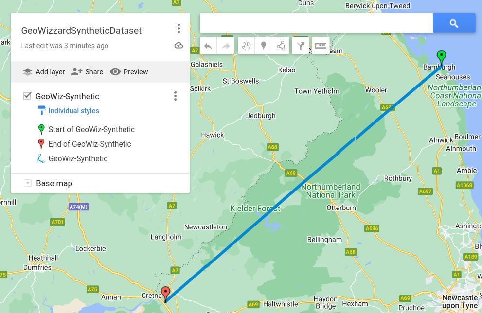

# geo-wizard
## Geo-Wizard synthetic dataset

We created a synthetic straight line and attempted walk map data to study forms of scoring route deviations. An approximation of the original straight line (in blue) map image is show below.



The map can be accessed via this [link](https://www.google.com/maps/d/edit?mid=1CEfPsf9b0YsAvp4JIoxUAg_aD2j7FdE&ll=55.171963961229764%2C-1.6774702774991779&z=9).

The following image shows the original straight blue line plus an orange line. This is a simulated walk where the path deviated from the original with zero mean and 100 metres standard deviation. The mauve line is a simulated walk where the path deviates from the original with zero mean and 50 metres standard deviation.

![Added atte,[s]](images/straight-line-and-walksx2_0_mean_100_stdev_50_stdev.png)

The map can be accessed via this [link](https://www.google.com/maps/d/edit?mid=1CEfPsf9b0YsAvp4JIoxUAg_aD2j7FdE&ll=55.20287313889983%2C-2.5403373008985253&z=15)

To generate data, clone the repository, then from the scripts directory run:

```
python generate-gpx.py \
--start_lat 55.6112176200343 \
--start_lon -1.702550745082108 \
--end_lat 54.97818870154609 \
--end_lon -3.001548002556341 \
--interval 100 \
--mean 0 \
--stddev 50 \
--planned_filename planned_trail.gpx \
--executed_filename executed_trail_0_mean_50_stdev.gpx \
--creator DanielSikar \
--name "GeoWizzardSynthetic_0_mean_50_stdev" \
--author_link https://www.github.com/dsikar \
--author_text GeoWizzard \
--author_type text/html   
```

The script will generate two files, the planned and the executed trail. In the example given, start point is Bamburgh Beach and end point is the M6 near Mossband. Both generated gpx files contain altitude data. The interval is 100 metres between points with a mean of 0 and a standard deviation of 50 metres. The additonal parameters are filenames and metadata for the gpx files.

## Future work

There are discussions around optimal scoring approaches for attempted straight line walks. [[1]](https://gis.stackexchange.com/questions/16322/measuring-straightness-of-curve-segment-represented-as-polyline) [[2]](https://www.reddit.com/r/GeoWizard/comments/nz7exq/a_better_way_to_rank_missions/). 

We intend to implement the current approaches and add our own, to include altitude data. 

If you would like to contribute, please clone, add your code and create a pull request.

The authors: daniel.sikar, maeve.hutchinson, naman.singh @city.ac.uk


